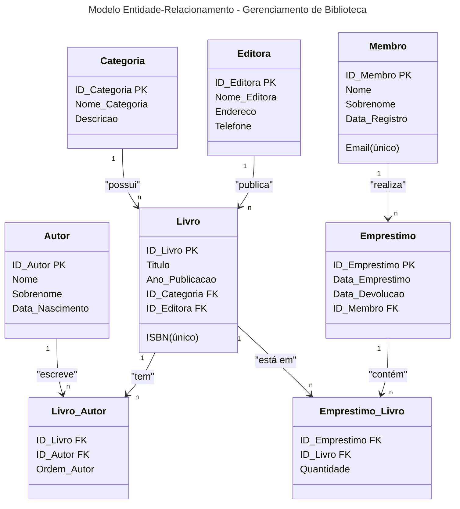

# Modelo Entidade-Relacional

## Entidades

**CATEGORIA**
- `ID_Categoria` (PK)
- `Nome_Categoria`
- `Descricao`

**EDITORA**
- `ID_Editora` (PK)
- `Nome_Editora`
- `Endereco`
- `Telefone`

**AUTOR**
- `ID_Autor` (PK)
- `Nome`
- `Sobrenome`
- `Data_Nascimento`
  
**LIVRO**
- `ID_Livro` (PK)
- `Titulo`
- `ISBN` (único)
- `Ano_Publicacao`
- `ID_Categoria` (FK)
- `ID_Editora` (FK)
  
**MEMBRO**
- `ID_Membro` (PK)
- `Nome`
- `Sobrenome`
- `Email` (único)
- `Data_Registro`
  
**EMPRESTIMO**
- `ID_Emprestimo` (PK)
- `Data_Emprestimo`
- `Data_Devolucao`
- `ID_Membro` (FK)

**LIVRO_AUTOR (Tabela Associativa)**
- `ID_Livro` (FK)
- `ID_Autor` (FK)
- `Ordem_Autor`
  
**EMPRESTIMO_LIVRO (Tabela Associativa)**
- `ID_Emprestimo` (FK)
- `ID_Livro` (FK)
- `Quantidade`

# Diagrama MER

