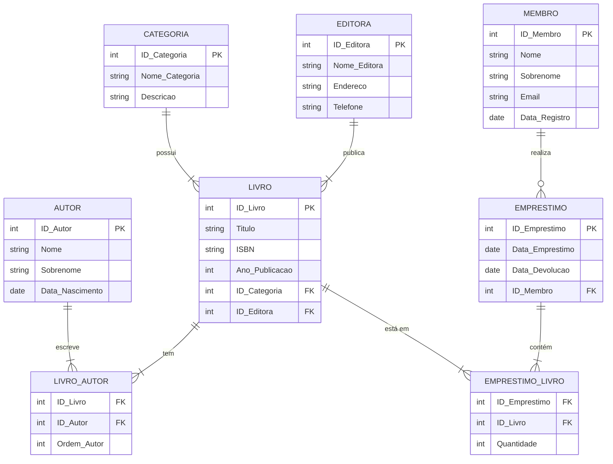

# MR -  Modelo Relacional 

```mermaid
erDiagram
    CATEGORIA {
        int ID_Categoria PK
        string Nome_Categoria
        string Descricao
    }

    EDITORA {
        int ID_Editora PK
        string Nome_Editora
        string Endereco
        string Telefone
    }

    AUTOR {
        int ID_Autor PK
        string Nome
        string Sobrenome
        date Data_Nascimento
    }

    LIVRO {
        int ID_Livro PK
        string Titulo
        string ISBN
        int Ano_Publicacao
        int ID_Categoria FK
        int ID_Editora FK
    }

    MEMBRO {
        int ID_Membro PK
        string Nome
        string Sobrenome
        string Email
        date Data_Registro
    }

    EMPRESTIMO {
        int ID_Emprestimo PK
        date Data_Emprestimo
        date Data_Devolucao
        int ID_Membro FK
    }

    LIVRO_AUTOR {
        int ID_Livro FK
        int ID_Autor FK
        int Ordem_Autor
    }

    EMPRESTIMO_LIVRO {
        int ID_Emprestimo FK
        int ID_Livro FK
        int Quantidade
    }

    %% Relacionamentos

    CATEGORIA ||--|{ LIVRO : "possui"
    EDITORA ||--|{ LIVRO : "publica"
    AUTOR ||--|{ LIVRO_AUTOR : "escreve"
    LIVRO ||--|{ LIVRO_AUTOR : "tem"
    MEMBRO ||--o{ EMPRESTIMO : "realiza"
    EMPRESTIMO ||--|{ EMPRESTIMO_LIVRO : "contém"
    LIVRO ||--|{ EMPRESTIMO_LIVRO : "está em"

```
